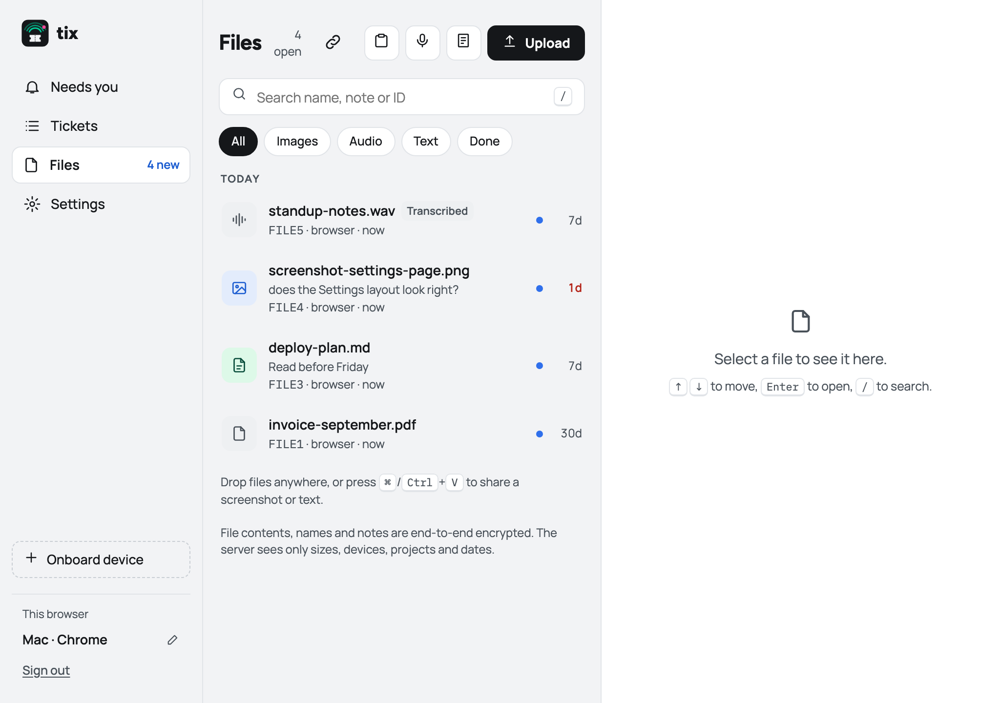
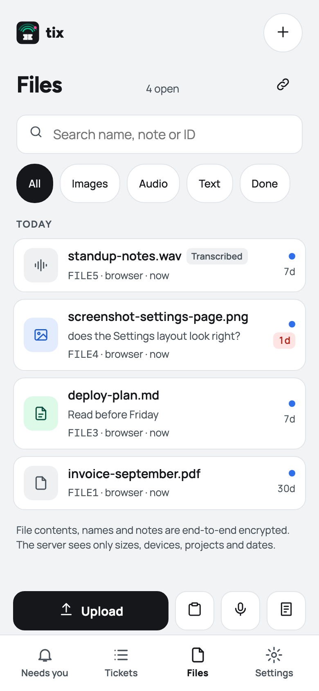
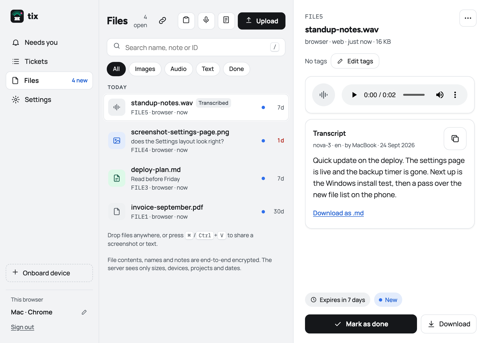
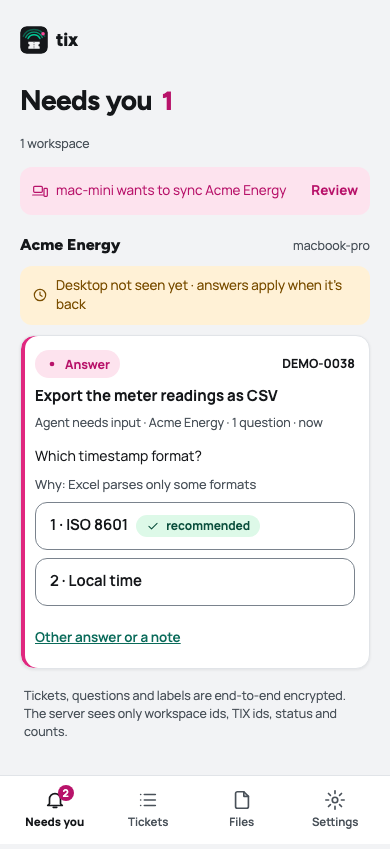
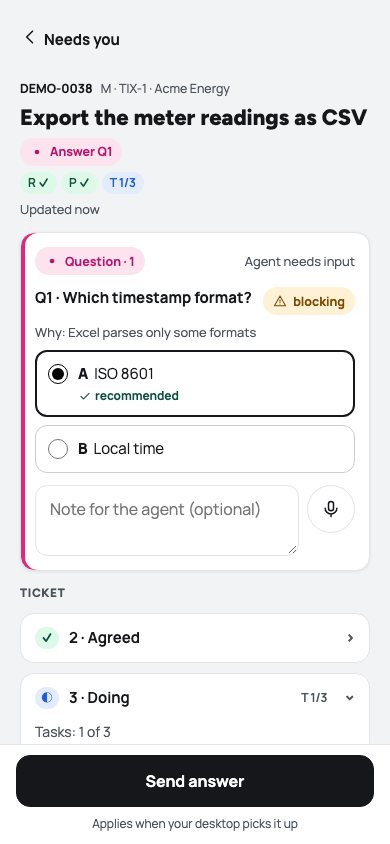

# TIX

**An end-to-end encrypted file share between your own devices, built for working with coding agents.**

Drop a log on your laptop, open it on your phone. Tell the agent in another repo "get me FILE7".
Answer the question an agent is blocked on from the train. The server in the middle stores only
ciphertext: file names, notes and contents are encrypted on your devices with keys it never sees.

TIX is one small Python server, a PWA you can install on your phone, and a Claude Code skill that
gives every repo on every machine the same share. It runs at [tix.severin.io](https://tix.severin.io);
you can host your own.

<p>
  
  
</p>

## What the server sees, and what it never sees

Your browser and your onboarded devices do the encryption. The server is a careful, dumb mailbox.

| The server stores in the clear | The server never sees |
|---|---|
| Ciphertext and its size | File contents |
| Which device uploaded it, and its project name | File names and notes |
| Timestamps, expiry, acknowledged / deleted | Your passphrase or recovery key |
| File tags (`weekly-report`, `notes`, so it can filter) | The master key, or any key that opens a file |
| For tickets: ids, status, counts, and whether this ticket may notify your phone (a yes/no you chose, off by default) | Ticket titles, questions, answers and gate text |

How that works, in short:

- **One master key, never on the server in usable form.** Your passphrase is stretched with
  PBKDF2 (600,000 rounds) in the browser; the server holds only a wrapped copy of the master key
  and a scrypt hash of a derived login key. A recovery key, shown once at setup, is the only other
  way back in.
- **Every file has its own key.** Content is AES-256-GCM in authenticated chunks, so a swapped,
  reordered or truncated blob is detected and never decrypted. Name, type and note are sealed the
  same way.
- **Devices join by fingerprint.** A new device gets a one-time code, generates its own key pair,
  and waits as `pending` until you compare its fingerprint and approve it in the browser. Revoking
  a device cuts its API access at once.
- **Fail closed.** The CLI refuses to run without working AES-GCM rather than fall back to
  plaintext.

What it does not protect against, stated plainly: a server that is compromised *and* serves you
modified JavaScript while you log in (true of all web-delivered crypto), a compromised device, and
one deliberate exception, **audio transcription**: with a Deepgram key set, audio you upload in the
browser is sent to Deepgram over HTTPS to be transcribed. The transcript comes back into the
file's encrypted metadata. You can turn that off.

The full, honest version, including every cleartext column, is in
[docs/threat-model.md](docs/threat-model.md).

## Features

- **Short IDs.** Every file is `FILE7`, never reused, case-insensitive. Easy to say to an agent.
- **Web app and installable PWA.** Upload, paste a screenshot, record a voice note, preview images, Markdown, JSON and text in place, mark files done.
  Offline uploads wait in an encrypted outbox until you are back online.
- **Transcripts.** Optional automatic transcription of voice notes (see the exception above).
- **Expiry.** Files expire after 1, 7 or 30 days, or never.
- **Tags.** Group files by kind and ask for "the newest three weekly reports".
- **Public links.** Share one file with anyone. The decryption key sits after the `#` and never
  reaches the server; links can expire, cap downloads and be revoked.
- **Upload links.** Let someone without an account send you one file, encrypted to that link.
- **Push notifications** that carry only ids and counts, never titles or text, and only for the tickets you switch on (off by default; per ticket, in Mission Control or in the app).

<p>
  
</p>

## The Claude Code skill

Onboarding a repo installs the `sharing` skill into `.claude/skills/sharing/`. From then on the
agent in that repo moves files for you in plain language:

```text
> get me FILE7
> share this test output to my other device
> what's on the share?
> make a public link for FILE12
```

Under the hood it is a single-file CLI (`skill/sharing/sharing.py`, run with `uv run --script`):

```bash
.claude/skills/sharing/sharing share build-log.txt -m "failing CI run" --json
.claude/skills/sharing/sharing list -n 20 --json
.claude/skills/sharing/sharing get FILE7 --json
.claude/skills/sharing/sharing update
```

It runs on macOS, Linux and Windows. The full command list is in
[skill/sharing/SKILL.md](skill/sharing/SKILL.md).

## Tickets from your phone

TIX is also the phone side of [orch-core](https://github.com/severinlindenmann/orch-core), a local ticket
workflow for agents. The `orch-tix` addon
([addons/orch-tix](addons/orch-tix)) mirrors the tickets that need you (a question, an approval, a
verdict) into TIX, sealed under your master key. The PWA lists them under **Needs you**.

The phone writes decisions, never tickets. It can also send short requests to your agents. An answer or approval is sealed, sent to your desktop
and applied there. An approval binds a hash of exactly the text the phone showed, so if the plan
changed in the meantime, nothing is approved.

- **Images on the phone are pinned.** A ticket shows only images that orch-core pinned by sha256 in the
  ticket (`artifact_items`) and that the desktop shared as a FILE. The phone downloads and decrypts the
  FILE like any file and shows it only when its bytes hash to the pinned sha256 (a mismatch shows the
  label). It never loads a URL from ticket text. At `full` the orch-tix addon shares the images the
  gated text shows or that prove a criterion.
- **Who agreed is named only from a signed ledger.** The mirror does not carry the desktop's signed
  ledger, so the phone uses orch-core's own wording ("approval not signed here", "closed, not signed
  here").

<p>
  
  
</p>

Details are in [docs/operations.md](docs/operations.md).

## Run it locally

You need [uv](https://docs.astral.sh/uv/) and Python 3.11 or newer.

```bash
git clone https://github.com/severinlindenmann/orch-tix
cd orch-tix
uv sync
export FS_DATA_DIR=./data FS_PUBLIC_URL=http://127.0.0.1:8808 FS_COOKIE_SECURE=0
mkdir -p "$FS_DATA_DIR"
uv run uvicorn --factory fileshare.app:create_app --host 127.0.0.1 --port 8808
```

In a second shell, with the same variables exported, create a one-time setup code:

```bash
uv run python -m fileshare.admin setup-code --data-dir ./data
```

Open <http://127.0.0.1:8808/setup>, paste the code and choose a passphrase. The first browser to
finish setup becomes the owner. **Keep the recovery key it shows**: losing both the passphrase and
the recovery key loses the files, and nobody can undo that.

Then use **Onboard device** in the web app to connect a repo. It gives you a one-line installer
(`curl … | bash` or `irm … | iex`) to run in that repo.

## Self-host on a VPS

The production setup is a plain systemd service under uv behind Caddy, with fail2ban watching
failed logins. No Docker, and no secrets in the environment file: there is no server-side key to
leak.

```bash
# from your laptop, at the repo root
FS_HOST=your-vps FS_DOMAIN=share.example.com bash infra/sync.sh --stage-only
# on the VPS
sudo bash ~/fileshare-staging/infra/prepare-vps.sh share.example.com
```

`prepare-vps.sh` creates the service user, installs uv, the systemd unit, the fail2ban jail and a
Caddy site, and validates Caddy before reloading it. Deploy updates with `bash infra/sync.sh`
(same `FS_HOST` and `FS_DOMAIN`). First login, restore, logs and bans are in
[infra/RUNBOOK.md](infra/RUNBOOK.md).

Settings are environment variables: `FS_DATA_DIR`, `FS_PUBLIC_URL` (lowercase, no `:443`),
`FS_MAX_UPLOAD`, `FS_COOKIE_SECURE`, `FS_SKILL_DIR`. See [fileshare/settings.py](fileshare/settings.py).

## Development

```bash
uv sync
uv run pytest -m "not e2e and not browser"   # server, CLI and crypto
node --test tests/js/                        # browser modules
uv run pytest -m e2e                         # real server and installer
uv run pytest -m browser                     # Playwright; needs: uv run playwright install chromium
```

Cross-language test vectors in `tests/vectors/` keep the Python CLI and the browser's WebCrypto
code byte-for-byte compatible. CI runs these suites, the CLI on Linux and macOS, and the orch-tix addon
tests against orch-core main, on every pull request to `main` and on `main` itself. See
[CONTRIBUTING.md](CONTRIBUTING.md).

| Path | What it is |
|---|---|
| `fileshare/` | The server (FastAPI, SQLite) and the web app in `fileshare/static/` |
| `skill/sharing/` | The `sharing` CLI and skill that onboarding installs |
| `addons/orch-tix/` | The orch-core addon that mirrors tickets |
| `infra/` | systemd unit, Caddy site, fail2ban, deploy scripts and runbook |
| `docs/` | Threat model and operations |

## Security

Please report vulnerabilities privately, never in a public issue: see [SECURITY.md](SECURITY.md).

## License

Apache License 2.0. See [LICENSE](LICENSE).
